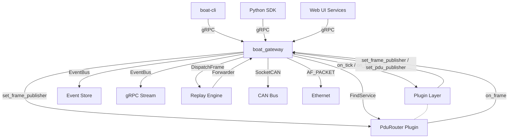

# System Architecture

## Layered Architecture

```text
┌──────────────────────────────────────────────────────────────────┐
│                         CLIENT LAYER                              │
│   CLI Tool (boat-cli)  │  Web Dashboard  │  External Tools        │
│   Python SDK           │  CI/CD Runners  │  IDE Plugins           │
└────────────────────────┬─────────────────────────────────────────┘
                         │ gRPC (port 50051)
┌────────────────────────▼─────────────────────────────────────────┐
│                      GATEWAY LAYER (boat_gateway)                 │
│   BoAt gRPC Server (all 14 services)                             │
│   PluginManager  │  Frame Dispatch  │  RPC Audit                 │
│   CanBusRegistry │  EthernetBusRegistry │  Replay Engine          │
│   TickTimer      │  SignalBus                                   │
└────────────────────────┬─────────────────────────────────────────┘
                         │ Plugin ABI v8 (dlopen C ABI)
┌────────────────────────▼─────────────────────────────────────────┐
│                       PLUGIN LAYER                                │
│   PduRouter  │  CanTp  │  TCP  │  SOME/IP  │  Probe  │  ...       │
└──────────────────────────────────────────────────────────────────┘
│
┌────────────────────────┬─────────────────────────────────────────┐
│                  SIMULATION CORE (C++)                            │
│  Scheduler (tick-based) │ Signal Router │ Plugin Manager          │
│  Event Bus              │ State Machine │ Determinism Engine      │
│  Fault Injector         │ Scenario Loader                        │
└──────────────────────────────────────────────────────────────────┘
                         │
┌────────────────────────▼─────────────────────────────────────────┐
│                   PERSISTENCE LAYER                               │
│  Event Store (SQLite) │ Config Store │ Trace Store (binary+index) │
└──────────────────────────────────────────────────────────────────┘
```

## Component Responsibilities

| Component | Language | Responsibility |
|---|---|---|
| `boat_core` | C++20 | Tick scheduler, signal router, determinism engine, PluginManager, Frame type |
| `boat_hil` | C++20 | CAN/Ethernet registry, drivers, bus bridges, PDU router internals |
| `boat_gateway` | C++20 | gRPC server, all 14 service implementations, replay engine wiring |
| `boat_ipc` | C++20 | Inter-process comm (gRPC, iceoryx2 SHM for large payloads, UDS) |
| `boat_store` | C++20 | Event/trace persistence, SQLite event store |
| `boat_replay` | C++20 | Deterministic replay engine |
| `boat_plugin_sdk` | C++20 (headers) | Plugin ABI v8 header-only SDK (plugin.h, frame.h) |
| `boat-py` | Python 3.11+ | Python SDK, gRPC stubs, test harness |
| `boat-cli` | Python | Command-line interface for all gateway services |
| `boat-ui` | Python (FastAPI) | 10 standalone web dashboards |

## Module Tree

```
boat-platform/
├── CMakeLists.txt                  # Root
├── cmake/
│   ├── BoAtPlugin.cmake            # add_boat_plugin() macro
│   ├── BoAtProto.cmake             # protobuf_generate() wrapper
│   └── Packaging.cmake             # CPack config
├── src/
│   ├── core/                       # Scheduler, signal router, event bus, plugin mgr,
│   │                               # state machine, determinism, fault, scenario, frame
│   ├── ipc/                        # gRPC, UDS, iceoryx2 SHM (large payloads only)
│   ├── store/                      # SQLite event/trace/config stores
│   ├── replay/                     # ReplayController, TimestampIndex (replay in core)
│   ├── hil/                        # CAN/Ethernet registries, drivers, bus bridges,
│   │                               #   PDU router sources (pdu_router.cpp, transmission_engine, ipdumcontainer, com, tick_timer)
│   ├── gateway/grpc_gateway/       # gRPC server entry point, all service implementations
│   └── plugins/                    # built-in plugins (v8 ABI, loaded at runtime) —
│       │                           #   stateful conversations / variation only:
│       ├── pdu_router/             # PduRouter — PDU routing, transmission engine, groups, deadlines
│       ├── can_tp/                 # ISO 15765-2 CAN Transport Protocol
│       ├── someip/                 # SOME/IP middleware (service discovery stub)
│       ├── tcp/                    # TCP plugin (state machine; transmits via core Eth registry)
│       └── probe/                  # gateway conformance probe (delivery/filter/self-sent/round-trip)
├── sdk/
│   ├── cpp/include/boat/
│   │   ├── plugin.h               # Plugin ABI v8 (9 vtable fields)
│   │   ├── frame.h                # Unified BoatFrame type (CAN/CANFD/ETH/TCP/PDU)
│   │   ├── can_tp.h               # CanTp C API (can_tp_send, can_tp_configure)
│   │   └── someip.h               # SOME/IP protocol constants
│   └── python/                     # boat-py package
├── cli/                            # boat-cli Typer application
├── proto/boat/v1/                  # 16 .proto files, 14 gRPC services
├── config/                         # PDU database JSON files
├── tests/                          # unit, integration, determinism, HIL
└── docs/                           # Documentation
```

## Plugin Loading Model

Each plugin is built as a shared library (`.so`, MODULE target, no `lib` prefix) and loaded at runtime via `dlopen`. The plugin entry point uses a stable C ABI:

```c
BoatPlugin* boat_plugin_create();
void boat_plugin_destroy(BoatPlugin* plugin);
uint32_t boat_plugin_abi_version();  // returns 8
```

Communication between the gateway and plugins uses **direct C function calls** through the vtable (`BoatPluginVTable`, 9 fields). The gateway calls `initialize`, `on_tick`, `shutdown`, and `on_frame` on each plugin. Plugins call back via `set_frame_publisher`, `set_publisher`, `set_bus_publisher`, and `set_pdu_publisher` to publish frames, signals, and PDUs back to the bus.

## Component Graph



Key data flows:
- **Frame I/O**: Plugin `on_frame` receives frames from the bus; `set_frame_publisher` sends frames to the bus
- **PDU routing**: PduRouter plugin registers itself as `IPduRouter` service; `PduServiceImpl` delegates via `FindService("pdu_router")`
- **Replay**: replay engine (in core) publishes events as `BoatFrame` to the frame bus
- **Tick**: gateway tick thread calls `PluginManager::TickAll(tick)` which calls each plugin's `on_tick`

## Architecture Decisions

- **Plugin ABI v8 unified frame type**: `BoatCanFrame`, `BoatEthFrame` removed; single `BoatFrame` with `bus_type` discriminator
- **PduRouter as plugin**: PDU routing logic removed from core gateway; loaded as `pdu_router.so` at runtime
- **FrameService gRPC**: unified send/subscribe endpoint alongside legacy CanService/EthernetService
- **Replay in core**: replay engine stays in core (not a plugin) — reads events from disk, publishes to frame bus
- **iceoryx2 SHM limited**: shared memory IPC used only within `boat_ipc` library for large payloads (>4KB), not for plugin communication
