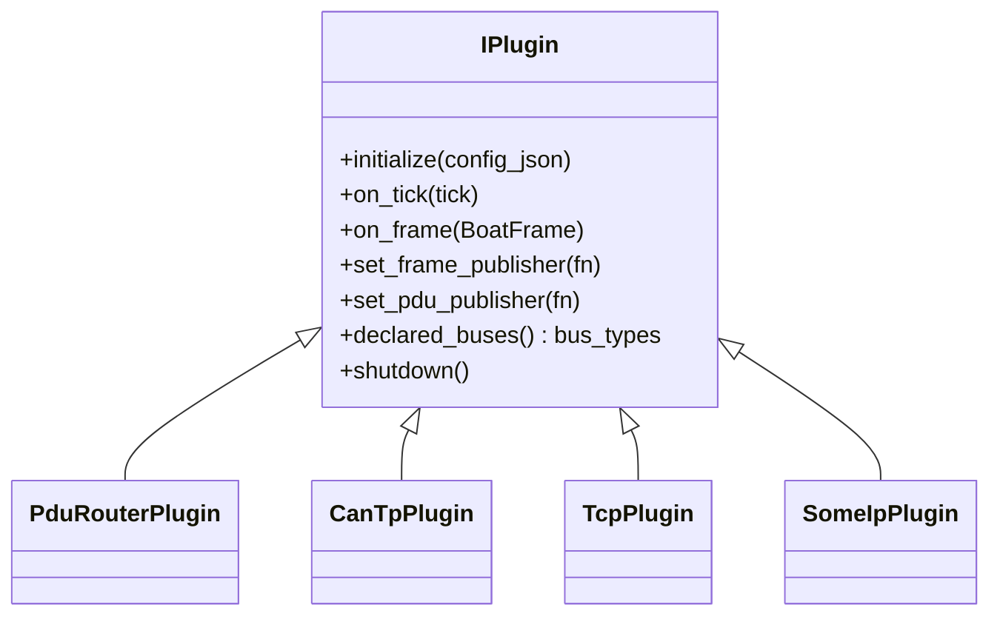
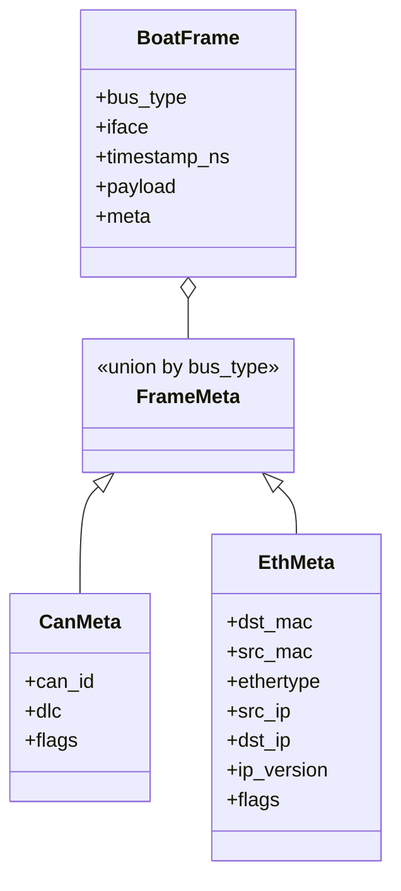
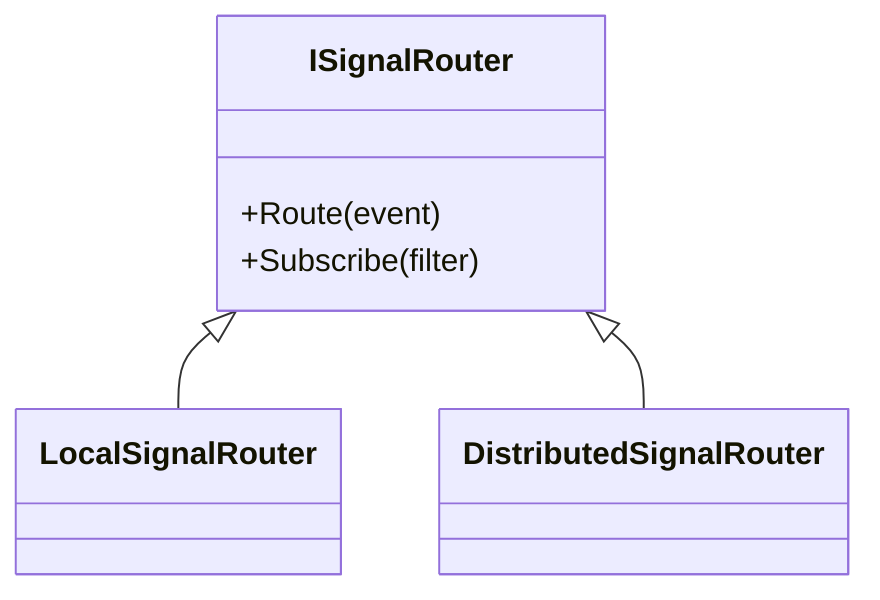
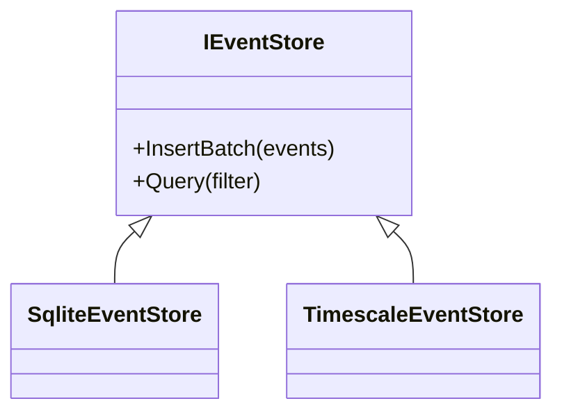
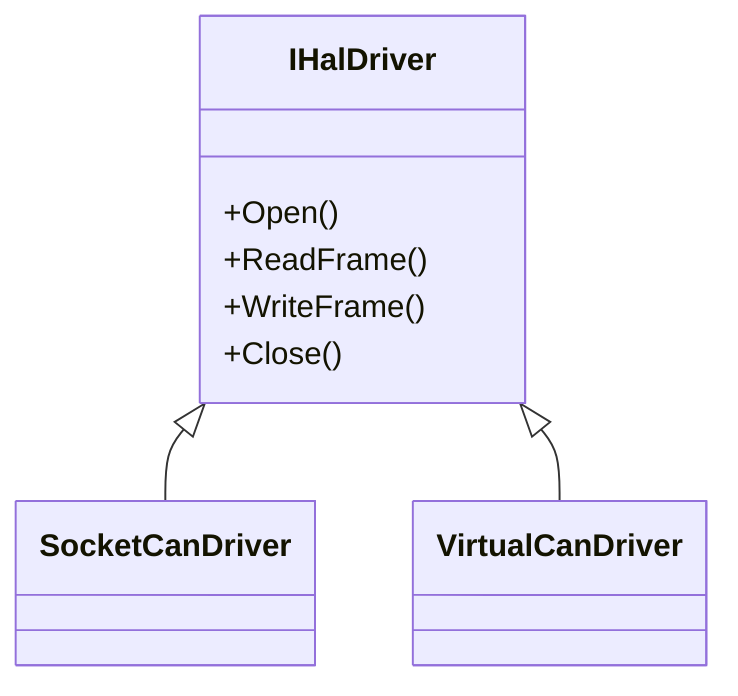

# Class Diagrams

## Plugin Hierarchy (ABI v8)

`IPlugin` in this diagram maps to the C ABI dispatch table `BoatPluginVTable`
(9 fields) defined in `sdk/cpp/include/boat/plugin.h`. `BOAT_PLUGIN_ABI_VERSION`
is **8**; a plugin reporting an older version is rejected at `dlopen`.
Implementations expose `boat_plugin_create`, `boat_plugin_destroy`, and
`boat_plugin_abi_version` entry points and route lifecycle calls through that
vtable. Plugins own **stateful conversations / variation** only — the kept set is
`pdu_router`, `can_tp` (ISO-TP), `tcp`, `someip`. Stateless CAN/Ethernet
transport is core (the gateway `FrameSink` + bus registries), not a plugin.

Key v8 methods:
- `on_frame(BoatFrame)` — the plugin receives frames dispatched by
  `PluginManager::DispatchFrame()`, filtered to the bus types it declared.
- `set_frame_publisher(fn)` — the gateway hands the plugin a callback it uses to
  publish outbound frames onto the bus (wired to the core `FrameSink`).
- `declared_buses()` — the set of `bus_type`s a plugin handles
  (e.g. `pdu_router` declares `["can","eth"]`, `tcp` declares `["eth"]`).

## Unified Frame Type

`BoatFrame` (`sdk/cpp/include/boat/frame.h`) is the single ABI frame type for all
bus types; the pre-v8 `BoatCanFrame` / `BoatEthFrame` types were removed. Its
`bus_type` discriminator is one of `CAN | CANFD | ETH | PDU | TCP`, and `meta`
holds bus-specific fields (CAN: `can_id`/`dlc`/`flags`; Ethernet:
`dst_mac`/`src_mac`/`ethertype`/`src_ip`/`dst_ip`/`ip_version`/`flags`). Its
internal counterpart is `core::Frame` (`src/core/`), which crosses the ABI
boundary via `core::Frame::ToAbi()`, and its wire/trace representation is the
`boat.v1.Frame` protobuf. The self-sent flags (`BOAT_CAN_FLAG_SELF_SENT = 0x08`,
`BOAT_ETH_FLAG_SELF_SENT = 0x01`) are set in the registry send path so plugins
can skip their own echoes in `on_frame` and avoid dispatch loops.

## Signal Router Hierarchy

## Event Store Hierarchy

## HAL Driver Hierarchy

`HilBridge` owns a `shared_ptr<IHalDriver>` and keeps a reference to `EventBus`.
CAN frame events use dedicated discriminators: RX `kEventTypeCanFrameRx = 0xCA1F0001`
and TX `kEventTypeCanFrameTx = 0xCA1F0002`.

