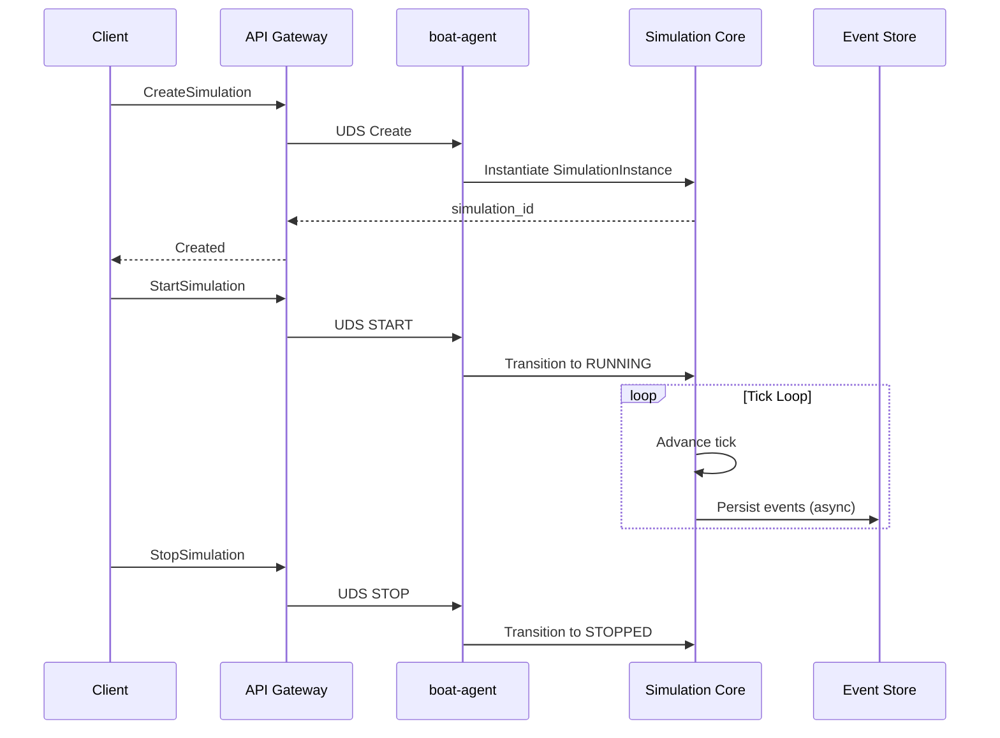
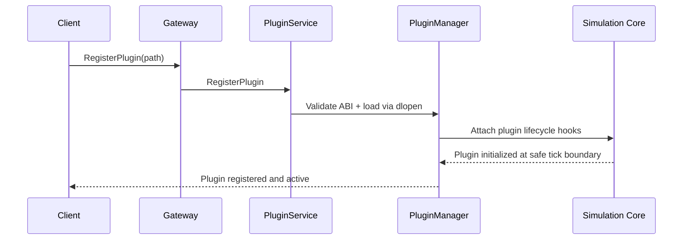
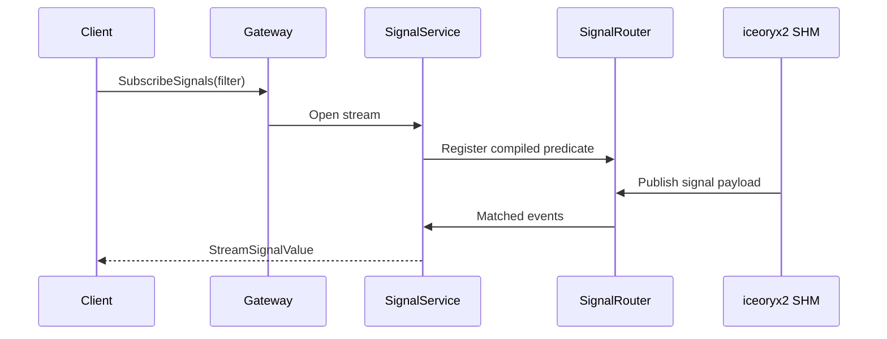
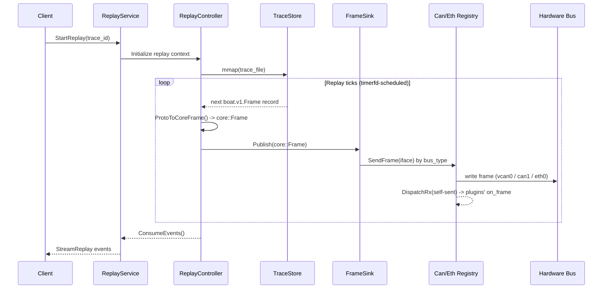
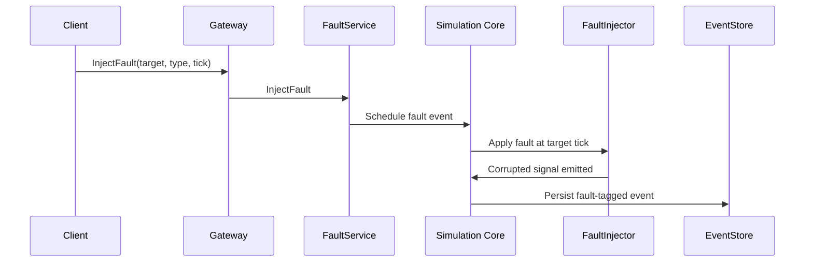

# Sequence Diagrams

## 1) Simulation Lifecycle (create -> start -> tick loop -> stop)

## 2) Plugin Hot-Load During Running Simulation

## 3) Signal Subscription and Streaming to gRPC Client

## 4) Deterministic Replay Flow (ABI v8, core sink)

Replay no longer injects events directly into the core, nor through a forwarder
plugin. It parses trace records into `core::Frame` and transmits each through the
single `FrameSink`, which routes to the bus registries. The registry's RX
dispatch then delivers replayed frames to plugins' `on_frame`.

## 5) Fault Injection Sequence

